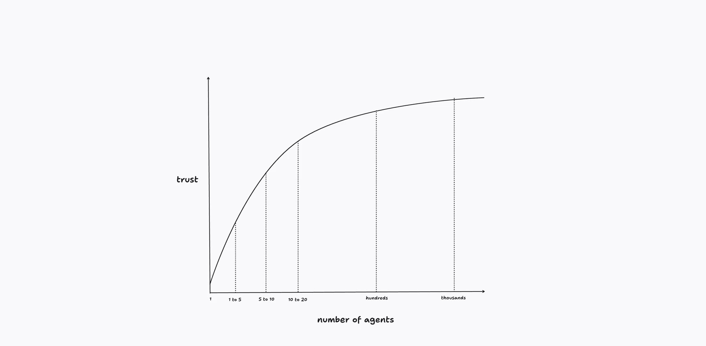
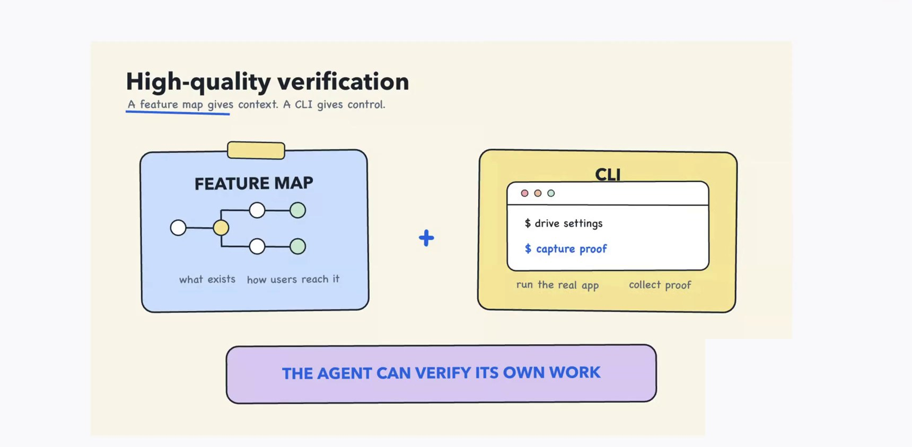
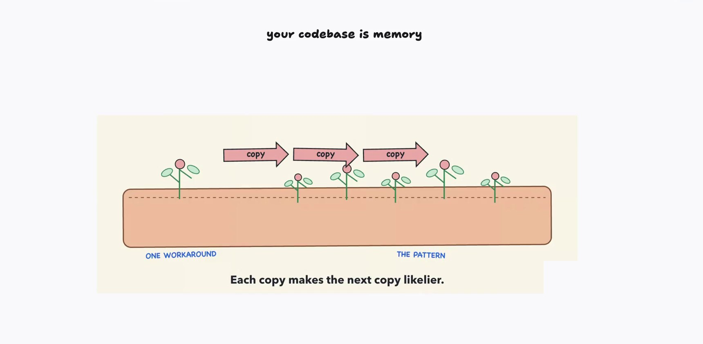
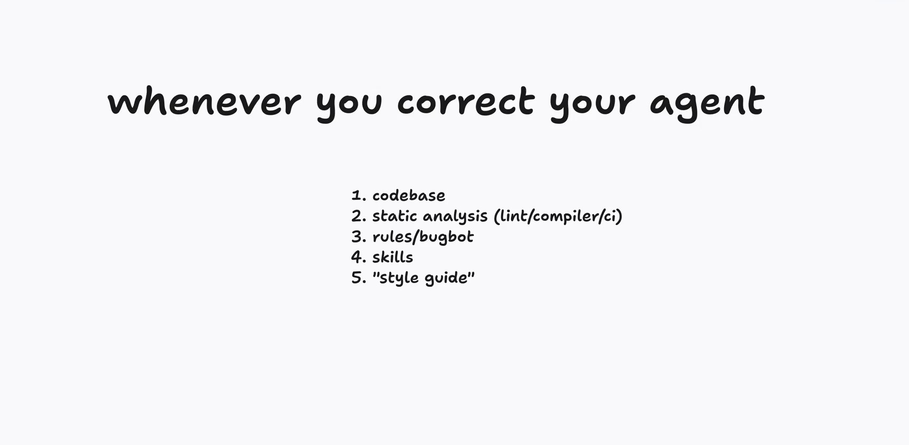
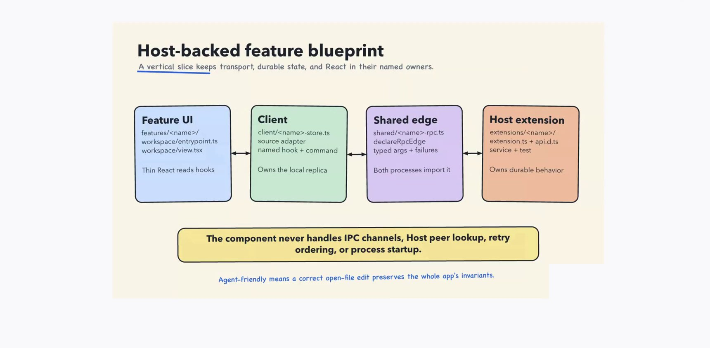

# "i shipped 2000 PRs last month" — full synthesis

**Speaker** lauren tan ([@poteto](https://x.com/poteto)) — Grok Bot @ SpaceXAI
**Source** <https://x.com/poteto/status/2102050467505430555> · 38:02 · posted free on X
**Origin** recorded for Cursor Compile (London); she couldn't attend in person
**Synthesized** 2026-09-25

| File | What it is |
| --- | --- |
| `README.md` | This report — argument, walkthrough, critical read |
| `slide-index.md` | All 28 canvas views, paired to concepts, with timestamps |
| `transcript.md` | Full timestamped transcript with slide markers |
| `transcript.srt` | Same, as subtitles |
| `slides/` | 28 slide screenshots, webcam and burned-in captions removed |
| `raw/` | Machine-readable segments, slide manifest, ASR correction rules |

---

## The argument in one paragraph

Throughput with coding agents is gated by **trust**, not by model capability —
and trust is something you manufacture by changing your environment, not
something you wait for a lab to ship. Tan's claim is that the hard transition
is not 100 agents to 1,000 but **1 agent to 5**: escaping the phase where you
babysit every conversation. You escape it by making three specific investments
— agents that can *verify their own work*, skills that encode how good
engineers actually work, and a codebase whose shape makes bad output difficult
— at which point you can fan out to hundreds of parallel agents without
drowning in slop. Her framing for the end state is a Michelin kitchen rather
than a factory: you stop cooking each dish and become responsible for the
kitchen.

The through-line, and the most quotable idea in the talk:

> the code base is really like the best form of memory because agents love to
> extend existing patterns that they see — 15:45

---

## 1. Trust is the bottleneck

The talk opens on receipts — three GitHub contribution graphs, flat for three
years then near-vertical from early '26 (`slides/slide-04_02m09s.jpg`) — and
then immediately reframes them as a *consequence* rather than an achievement:

> I never set out to ship 2,000 pull requests a month. That was not a goal of
> mine at all… I am the bottleneck and I need to be able to take all of the
> knowledge that I have as an engineer and impart them into my team of agents —
> 04:14

The curve above is the talk's spine. Her diagnosis of the 1-to-5 band is the
sharpest thing in the first ten minutes: it's the hardest band to escape
precisely because the exit isn't obvious, and the naive exit fails loudly. Fan
out to a hundred agents without having built trust first and you get "a ton of
slop pull requests… a bunch of regressions and a bunch of bugs shipped."

The origin story is worth keeping because it explains the whole method. She
joined Cursor six months earlier to fix performance in the agent window, found
herself hand-driving Chrome DevTools, taking traces and heap snapshots against
a wall of incoming PRs, and got frustrated enough to ask the obvious question —
*we have agents; what am I doing?*  Every technique in the talk is downstream
of automating her own manual loop.

## 2. Verification: let the agent prove its own work

The first skill she built, `control glass`, teaches an agent to drive the real
application over the Chrome DevTools Protocol and collect traces. Two
components made it work, and the second is the non-obvious one:

- **A CLI, committed inside the skill directory.** Not scripts the agent writes
  fresh each session — a real interface, invested in, that runs the app the
  same way every time.
- **A feature map.** Her own coinage, "a form of materialized memory": what
  features exist, how a user reaches each one, which DOM elements and keyboard
  shortcuts get you there. Maintained by its own automation.

The CLI alone wasn't enough. The failure mode that forced the feature map is
very concrete: a user pastes a small screenshot of some UI and three question
marks into Slack, and the agent — able to drive the app but with no model of
it — just guesses. Context plus control is what closes the loop.

She's careful to bound the claim. Verification buys *correctness* — does the
checkout button check out the cart — and nothing else. Code quality and
performance are a separate investment (her `pstack` plugin, a collection of
skills encoding debugging and feature-development playbooks). And she names the
far end of the spectrum honestly: formal methods, Lean, TLA+, "still very much
an open question," and out of reach for almost everyone. You can get very far
without it.

## 3. Your codebase is memory

This is the section with the most intellectual leverage, and it runs in both
directions.

Forward: agents extend what's in front of them, and the files they open *are*
the context window, so the codebase is the highest-bandwidth channel you have
into their behavior. Backward — the part most people miss — anti-patterns are
**self-amplifying**. One workaround gets copied, the copy makes the next copy
likelier, and "in a matter of a few days or a few weeks" it's the de facto
house style.

Her worked example is genuinely counterintuitive: **Dune bans comments.** Not
because comments are slop, but because of what she watched them become —

> agents were just using the comments around the code as justification for why
> it wasn't going to solve the actual problem, and instead paper over it with a
> band-aid — 23:10

This produces the correction ladder, which she names as the one slide to take
away:

Read it as a priority order. When you catch yourself correcting an agent, push
the fix as far up the list as it will go: change the codebase so the mistake is
*categorically impossible*, else add static analysis, else rules/Bugbot/skills.
Level 5 — the style guide, enforced by humans in review — is the one that does
not scale, and at her PR volume "it just becomes impossible."

The role she proposes to own this is a **gardener**: delete tech debt, keep one
paved path, lint against anti-patterns. The triage instinct is good — when you
spot an anti-pattern, write the lint rule immediately even if you can't clean
up the existing instances, because that "stops the bleeding."

> you want that code base to be so pristine, so great, that the next agent that
> comes along is just very likely to continue that pattern — 30:12

## 4. Architecture, and then automation

Dune is their in-house Electron framework, built on one principle: **agents
love taking shortcuts, so make the easy path the right path.** She's blunt that
the result is "pretty annoying for humans to work in" — that's the trade, and
she thinks it's worth it, because contributors are increasingly not engineers
at all: designers, PMs, CEOs shipping features with minimal context.

The concrete moves (detailed in `slide-index.md`): five nouns each with one
place in the tree and one runtime job; process boundaries expressed as folders,
so a directory tells an agent where code runs and which imports are legal;
`shared/` for cross-process types. The motivating bug class is specific — slow
code accidentally imported into the renderer thread, blowing a 16ms frame
budget — and the fix is to make that import *illegal* rather than reviewable.
The definition to steal:

> Agent-friendly means a correct open-file edit preserves the whole app's invariants.

Only once all of that exists does automation pay off. Grok Bot supplies what
she calls the **outer loop** — connectors into Slack, Datadog, Sentry,
PlanetScale — and routines subscribe to threads and alerts, kicking off cloud
agents automatically. She explicitly deflates the ambition here: you don't need
a "company brain," because agents are already good at using tools. The payoff
screenshot is a bot in `#glass-oncall-assistant` posting **"Reproduced but
already fixed on main"** against a user's bug report, with a `[view cloud
agent]` link — bugs triaged and PRs opened with no human in the loop, which is
only possible because the verification skill and feature map from §2 are what
let it decide "reproduced" at all.

---

## Critical read

Taking the talk seriously means pushing on it. Five things.

**1. The number doesn't survive contact.** The title says 2,000 PRs last month,
the receipts slide says 5,000+ in six months, the X post says 2,500. Three
accounts summing 13,124 commits are shown without saying how they relate. More
importantly, *PR* is never defined, and agent-authored PRs are typically small
and numerous by construction. The count is a real signal of a changed workflow;
it is not a productivity multiplier you can compare against your own team's.

**2. A talk about empiricism offers none about itself.** The central argument
is that verification gives you empirical evidence instead of vibes. But the
trust curve has an unlabeled y-axis, and there is no revert rate, no escaped
defect count, no incident data, no before/after on the performance work that
started the whole story. The strongest available evidence for the thesis —
*did quality actually hold at 2,000 PRs/month?* — is exactly what's missing.

**3. Review is the unaddressed hole.** She's right that line-by-line human
review collapses at this volume, and she names what replaces it for *mechanical*
correctness: types, lint, CI, Bugbot. She never says what catches semantic
regressions — the change that compiles, passes, satisfies every rule, and is
still wrong about what the product should do. At 2,000 PRs/month somebody is
either reading a sample, or nobody is.

**4. The conditions are unusually favorable, and she flags it without
addressing it.** "(greenfield vs brownfield)" sits in grey on her own slide and
never comes back. "Delete tech debt, ban comments, lock the codebase down, build
your own framework" is affordable for a strong engineer on a young codebase at
a company whose product *is* agent tooling and which controls the framework end
to end. In a ten-year-old brownfield monolith the correction ladder still
applies, but its top rung — make it categorically impossible — is often the most
expensive option rather than the cheapest.

**5. Banning comments is a local optimum.** The diagnosis is sharp; the remedy
removes a general-purpose tool because agents abused it. It likely works inside
Dune *because* everything else is so constrained that there's nothing left to
explain. Ported into a codebase without those constraints, it removes the
explanation and leaves the workaround.

None of this undermines the core claim. It sharpens where it applies.

## What's actually transferable

Ranked by value-per-unit-effort, independent of stack:

1. **The correction ladder.** Free, framework-agnostic, immediately useful.
   Next time you correct an agent, ask which of the five levels should have
   caught it and fix it there instead of in chat.
2. **Verification as committed infrastructure.** A real CLI in the skill
   directory, maintained like production code, so agents stop writing throwaway
   scripts. The single highest-leverage build in the talk.
3. **The feature map.** Materialized memory of your app's surface — what exists
   and how a user reaches it — maintained by automation. Cheap, and it's what
   turns a vague bug report into something an agent can act on.
4. **Anti-patterns spread; lint immediately.** The gardener's triage move. You
   don't need to clean up the instances to stop the propagation.
5. **Encode boundaries in the tree.** Even without a Dune, making illegal
   imports actually illegal converts a recurring review comment into a
   build error.
6. **Dune's specific shape.** Genuinely useful as an existence proof and a
   source of ideas; least directly portable, being Electron- and
   xAI-specific.

## Open questions worth chasing

- What does code review look like at this volume — sampling, agent review, or
  something else? The talk's biggest gap.
- What's the revert and incident rate, before and after?
- How much of this survives on a large brownfield codebase you don't control?
- `pstack` is mentioned as a plugin but never shown. What's in it?
- Where's the ceiling? The trust curve saturates by construction, but she
  doesn't say what she's hit.

---

## Method

Video pulled with `yt-dlp` at 1080p. Audio transcribed with `faster-whisper`
(`distil-large-v3`, int8, beam 5, VAD) — X carries no captions, so this is ASR,
not an official transcript. Recurring proper-noun misreadings were corrected
against the slides (`raw/fixups.py`, 47 of 357 segments touched); the rest is
unedited, so expect residual errors.

Slides were found by extracting all 761 keyframes, masking the webcam and the
burned-in caption strip so they couldn't register as changes, then clustering by
16×16 dHash against a moving anchor. The cluster count is stable at 27–32 across
thresholds from 0.04 to 0.14, so the ~28 views are a real structural feature of
the deck rather than an artifact of tuning. Views held ≥12s were kept and one
representative frame extracted per view, then read and OCR'd to pair each to its
concept.

Quotes are short and timestamped; screenshots are the speaker's own slides,
reproduced here as commentary. The talk was released publicly and free by its
author.
